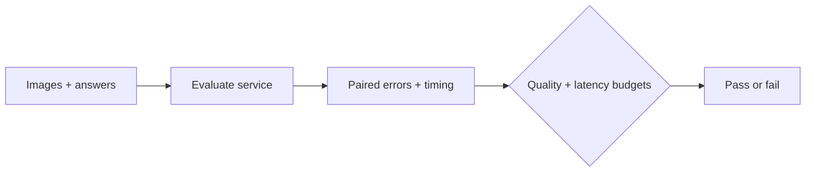

# VLM Precision Lab

Test a quantized vision model on **your images and service budgets** before deployment.

[中文](README.zh-CN.md) · [Real-receipt study](experiments/results/2026-10-05/cord-service/) · [Recorded synthetic demo](https://crown-sports.github.io/vlm-precision-lab/) · [Run guide](docs/service-evaluation.md)

Smaller weight files do not guarantee a faster deployment or correct critical fields.
Compare BF16 and quantized runs on the same labelled images, then gate task quality,
failed requests, first-answer latency and throughput against explicit targets.



## Use it

Start your vision chat service, then run:

```bash
pip install git+https://github.com/crown-sports/vlm-precision-lab.git@v0.2.0
precisionlab evaluate --dataset samples.jsonl \
  --endpoint http://localhost:8000/v1 --model model \
  --concurrency 4 --output runs/quantized
precisionlab gate --dataset samples.jsonl --run runs/quantized \
  --constraints targets.json --output runs/decision.json
```

`gate` exits **0** when the observed targets pass, **2** when they fail.
Choose task and latency targets for your workload; [input format and examples](docs/service-evaluation.md) are documented.
To compare two runs, use `precisionlab compare` with their prediction files.

## Measured on real receipts

Qwen3-VL-8B-Instruct, RTX 5090, vLLM 0.11.0, equal 2 GiB KV cache.
CORD-v2: 100 dev receipts / 273 questions; 99 labelled test receipts / 258 questions.
Recorded **3792 measured requests**, with three dev timing repeats per concurrency.

| Measurement | BF16 | AWQ W4A16 |
| --- | ---: | ---: |
| Sampled whole-device workload peak | 21.67 GiB | 12.11 GiB (−44.1%) |
| Median successful requests/s, concurrency 1 | 3.008 | 3.661 (+21.7%) |
| Median successful requests/s, concurrency 4 | 7.002 | 7.874 (+12.5%) |
| Test total-field literal exact match | 82.11% | 84.21% |
| Predeclared 95% per-field quality gate | **FAIL** | **FAIL** |

AWQ introduced **two total-amount content errors** despite a net accuracy increase.
The total-field difference's 95% paired interval is **[−3.16, +7.37] pp**;
it does not establish loss within the predeclared 2 pp margin.
Literal scoring uses parsed CORD annotations, which can differ from printed currency spacing.
[Full results, timing ranges, original wrong-answer images and limitations](experiments/results/2026-10-05/cord-service/)
are public. One measured deployment per variant, sequential BF16 then AWQ;
these observations do not guarantee a speedup on another workload.

## What is verified

- The client, failure handling, evidence checks and recorded-result arithmetic pass **31 CPU tests**.
- Dataset, checkpoint and processor files were checked; raw requests, launch records,
  failed-startup evidence and NVML samples are archived.
- Earlier synthetic HF experiment: files **17.53 → 7.22 GB**; peak **allocated**
  memory **16.47 → 20.26 GiB**. [Separate evidence](experiments/results/2026-10-03/);
  its memory metric is different from whole-device NVML usage.

API fingerprints verify client requests; they do not attest hidden server tensors or resident GPU weights.
AWQ comes from [LLM Compressor](https://github.com/vllm-project/llm-compressor),
and Marlin from the serving stack; this project adds controlled evaluation and deployment checks.

[Import real receipts](docs/service-evaluation.md#receipt-data) · [Replay 300 saved cases without a GPU](https://crown-sports.github.io/vlm-precision-lab/) · [GPU experiment reproduction](docs/reproduce.md)

Apache-2.0. External models and datasets retain their own licenses.
