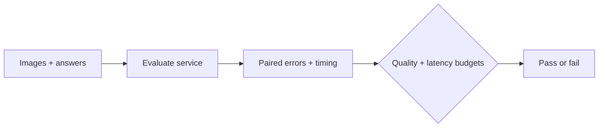

# VLM Precision Lab

Test a quantized vision model on **your images and service budgets** before deployment.

[中文](README.zh-CN.md) · [Recorded demo](https://chrischen-coder.github.io/vlm-precision-lab/) · [Run guide](docs/service-evaluation.md) · [Design](docs/design.zh-CN.md)

Smaller weight files do not guarantee a faster deployment or correct critical fields.
Compare BF16 and quantized runs on the same labelled images, then gate task quality,
failed requests, first-answer latency and throughput against explicit targets.



## Use it

Start your vision chat service, then run:

```bash
pip install git+https://github.com/chrischen-coder/vlm-precision-lab.git@v0.2.0
precisionlab evaluate --dataset samples.jsonl \
  --endpoint http://localhost:8000/v1 --model model \
  --concurrency 4 --output runs/quantized
precisionlab gate --dataset samples.jsonl --run runs/quantized \
  --constraints targets.json --output runs/decision.json
```

`gate` exits **0** when the observed targets pass, **2** when they fail.
Choose task and latency targets for your workload; [input format and examples](docs/service-evaluation.md) are documented.
To compare two runs, use `precisionlab compare` with their prediction files.

## What is verified

- The client, failure handling, evidence checks and budget gates pass **20 CPU tests**.
- CORD-v2 import: **100 receipts, 273 field questions**, pinned source hashes verified.
- Earlier Qwen3-VL-8B AWQ experiment: files **17.53 → 7.22 GB**; HF peak allocated
  memory **16.47 → 20.26 GiB**. [Raw evidence](experiments/results/2026-10-03/).

CORD model predictions and controlled vLLM GPU benchmarks are **not yet recorded**.
API fingerprints verify client requests; they do not verify hidden server tensors or weight identity.
AWQ comes from [LLM Compressor](https://github.com/vllm-project/llm-compressor); this release adds evaluation and deployment checks.

[Import real receipts](docs/service-evaluation.md#receipt-data) · [Replay 300 saved cases without a GPU](https://chrischen-coder.github.io/vlm-precision-lab/) · [GPU experiment reproduction](docs/reproduce.md)

Apache-2.0. External models and datasets retain their own licenses.
