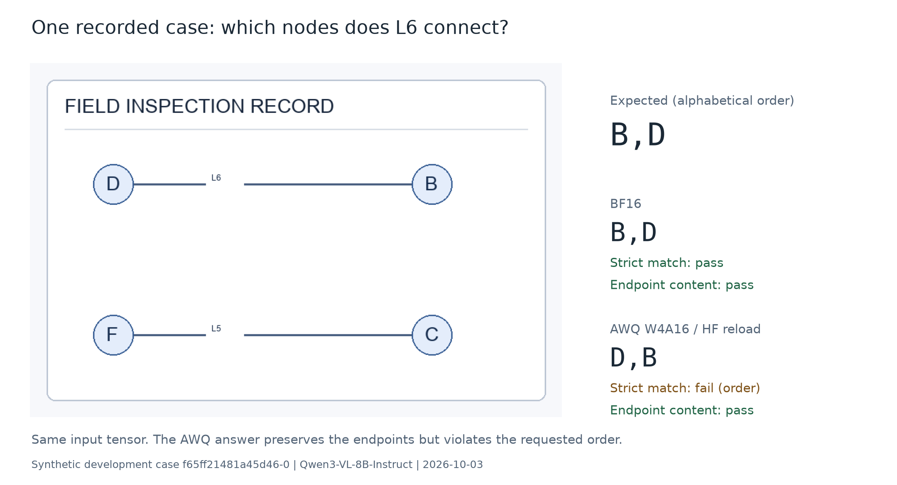

# VLM Precision Lab

检查图文模型量化前后，哪些具体答案变了，以及这些变化来自哪里。

[查看演示](https://chrischen-coder.github.io/vlm-precision-lab/) · [技术设计](docs/design.zh-CN.md) · [完整实验记录](docs/experiments.zh-CN.md) · [English](README.md)

## 先看一个真实记录

下图的问题是：标为 **L6** 的线连接哪两个节点？要求按字母顺序回答。



标准答案是 `B,D`。BF16 回答 `B,D`，AWQ 回答 `D,B`。
后者违反了输出顺序要求，但端点没有识别错。两个问题需要分别统计：
输出是否符合接口要求，以及模型是否找对了连线。

[演示页](https://chrischen-coder.github.io/vlm-precision-lab/)可以切换这两种评分，
查看全部 300 条记录，也能看两个模型都答错的例子。页面回放已保存的推理结果，不调用在线模型。

## 要解决什么问题

模型量化后，总分变化不大，并不意味着原来正确的答案都保住了。
金额的负号、标识符的末位、图中的一条连线，都可能是实际应用不能接受的错误。
另外，图片缩放和解码设置的变化，也可能被误认为量化误差。

这个项目把原图、问题、答案、输入张量指纹和运行配置放到同一份对照里，
逐任务列出“原来正确、压缩后错误”和“原来错误、压缩后正确”的样例。
校准选样按实际输入 token 计费，后续配方按完整模型的测量结果筛选。

## 目前做到了哪里

已完成 Qwen3-VL-8B-Instruct 的 decoder AWQ W4A16 导出和独立 HF 重载，
视觉模块与 `lm_head` 保持 BF16。实测使用 300 个合成开发样例，来自 150 个生成来源。

| 指标 | BF16 | AWQ 导出后重载 |
| --- | ---: | ---: |
| 权重文件，十进制 GB | 17.53 | 7.22 |
| 数字字段严格正确 | 100/100 | 100/100 |
| 接口标识严格正确 | 100/100 | 100/100 |
| 图端点正确，不计顺序 | 50/100 | 53/100 |
| 图回答严格匹配 | 41/100 | 33/100 |
| 全运行峰值 Torch allocated，GiB | 16.47 | 20.26 |

文件减少了 **58.8%**。11 个严格评分退化的样例都找对了端点；本批数据没有内容退化。
HF 检查路径的内存和耗时反而增加。因此，目前的成果是文件压缩和可追查的质量检查。
真实文档质量、优化引擎的显存与速度，还需要分别验证。

代码已有数据校验、三种校准选样、逐样本比较、输入与配置核验，以及已测配方筛选。
**自动选层尚未实现**，这份数据也没有证明它有必要。

## 不用 GPU 也能复现

```bash
python3 -m venv .venv
.venv/bin/pip install '.[test]'
.venv/bin/precisionlab compare --dataset examples/diagnostic-v2/samples.jsonl \
  --reference experiments/results/2026-10-03/p1-bf16/predictions.jsonl \
  --candidate experiments/results/2026-10-03/p1-awq-reload/predictions.jsonl \
  --output runs/awq-report.html
```

下载仓库后，也可以直接打开 `demo/index.html`。它使用仓库中的原图，不需要 API key。
[GPU 复现步骤](docs/reproduce.md)和[原始记录](experiments/results/2026-10-03/)均已公开。

后续先评测真实文档，再决定是否做任务驱动的精度保留。
具体技术难点、已有工作的区别和实验安排见[技术设计](docs/design.zh-CN.md)。

代码采用 Apache-2.0；模型和外部数据沿用各自许可。
