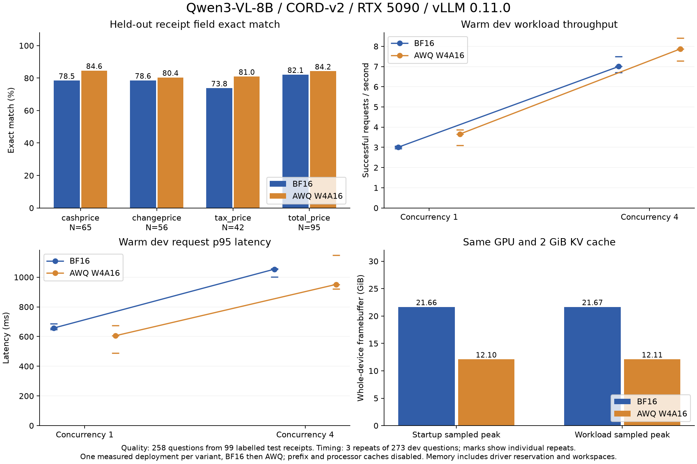

# 真实收据上的量化部署：显存降低 44.1%，仍未通过金额质量门槛

在一张 RTX 5090 上，用相同的 vLLM 服务设置比较 Qwen3-VL-8B-Instruct BF16 与既有 AWQ W4A16 导出。AWQ 的工作负载显存采样峰值从 **21.67 降到 12.11 GiB**，开发集并发 1、4 的吞吐量中位数分别提高 **21.7%、12.5%**。但两种模型的四类测试字段都未达到预设 95% 正确率，AWQ 还出现 **2 个 BF16 正确而自己错误的总金额样例**。本轮结论是：记录成本收益，拒绝按当前质量目标放行。

[完整证据](../experiments/results/2026-10-05/cord-service/) · [冻结方案](../experiments/cord-service-protocol.json) · [英文结果摘要](../experiments/results/2026-10-05/cord-service/README.md)



## 实验控制与可复查证据

方案在首个模型结果产生前提交到 [197583b](https://github.com/crown-sports/vlm-precision-lab/commit/197583b6e42e016fa307cf59451799bbf2e55764)。基础模型固定为 `0c351dd01ed87e9c1b53cbc748cba10e6187ff3b`；CORD-v2 固定为 `7f0115a4b758a71d6473b8d085751692da2fef98`，下载时核对 parquet SHA256，导入时核对图片及样本指纹。开发集为官方 validation 的 100 张收据、273 个问题；测试源为 100 张收据，其中 99 张包含所选字段，共 258 个问题。两份数据按实际图片哈希及来源组检查交叉重复。

AWQ 使用先前 177 个合成问题的校准导出，没有用 CORD 开发集或测试集校准、挑选提示词。量化复用 LLM Compressor，视觉模块和 `lm_head` 未量化。服务日志确认使用 `MarlinLinearKernel`；本项目贡献是评测、控制变量、兼容修复和证据分析。

两组均使用 vLLM 0.11.0、PyTorch 2.8.0 CUDA 12.8、Transformers 4.57.3、compressed-tensors 0.11.0，单 GPU、BF16 激活、**固定 2 GiB KV cache**，关闭 prefix cache 和多模态处理缓存，eager 执行。上下文 4096，图像像素范围 3136–393216，温度 0、种子 42、最多输出 32 token。每个工作负载先发 4 个 warmup 请求；开发集在并发 1、4 下各重复 3 次，测试集仅跑并发 1。共记录 14 份结果、**3792 个计分请求**，不含 56 个 warmup 请求。

原始请求、预测、计时、显存采样、启动命令、依赖清单、权重文件核验、启动失败记录及实际执行脚本均归档。模型服务依次运行 BF16、AWQ；每种只有一次成功的完整测量部署。AWQ 曾在任何请求发送前启动失败，修复配置后续跑，保留 BF16 全部结果。

## 测试质量与放行结果

主指标按 CORD **解析字段标注**计算 literal exact match，使用 NFKC 和首尾空白清理，保留货币文本、数字分隔符及大小写。这不是官方 CORD parsing F1，也不能直接解释为逐字 OCR 正确率或金额内容正确率。每种模型取首次并发 1 的结果，重复压测不增加质量样本量。

| 字段 | 问题数 | BF16 EM | AWQ EM | 差值（百分点）及 95% 区间 | 退化 / 恢复 |
| --- | ---: | ---: | ---: | ---: | ---: |
| 现金付款 | 65 | 78.46% | 84.62% | +6.15 [ +1.54, +12.31 ] | 0 / 4 |
| 找零 | 56 | 78.57% | 80.36% | +1.79 [ 0.00, +5.36 ] | 0 / 1 |
| 税额 | 42 | 73.81% | 80.95% | +7.14 [ 0.00, +16.67 ] | 0 / 3 |
| 总金额 | 95 | 82.11% | 84.21% | +2.11 [ −3.16, +7.37 ] | 2 / 4 |

区间使用按收据来源组配对 bootstrap，10,000 次，种子 42。总金额虽然净正确率提高，其区间下界低于预定 −2 个百分点，**不能确认质量损失在 2 个百分点以内**。其余字段在本次经验区间内满足该规则，但零退化的有限样本 bootstrap 不能证明总体不存在稀有错误。

BF16、AWQ 的最终 gate 均为 **FAIL**：四类 EM 都低于 95%。请求成功率 100%、无输出截断、来源组不少于 90、p95 延迟和首段答案延迟则达标。这些是提前设定的研究目标，并非真实客户 SLA。

两处总金额退化已经核对原图，不能归为标点或空白差异：

| 测试收据 | 原图/标注 | BF16 | AWQ | 可观察的问题 |
| --- | --- | --- | --- | --- |
| [第 20 行](../experiments/results/2026-10-05/cord-service/review-images/test-20.png) | 377,859 | 377,859 | 377,059 | 数字 8 被读成 0 |
| [第 42 行](../experiments/results/2026-10-05/cord-service/review-images/test-42.png) | Total 16,500；Cash 50,000 | 16,500 | 50,000 | 总金额答案采用现金字段 |

观察可以定位错误类型，尚不能证明内部注意力或某个量化层是成因。两组受控部署的差异有证据支持，更细的因果机制需要另做消融。

## 服务成本：中位数与波动一起报告

下表每格为三次开发集工作负载的中位数 `[最小值, 最大值]`。吞吐量是客户端闭环成功请求数/完整墙钟时间，包含图片准备；逐请求延迟不包含图片编码，包含请求序列化、排队与解码。

| 并发 | BF16 请求/秒 | AWQ 请求/秒 | BF16 p95 延迟 ms | AWQ p95 延迟 ms |
| ---: | ---: | ---: | ---: | ---: |
| 1 | 3.008 [2.928, 3.054] | 3.661 [3.093, 3.867] | 657.6 [646.9, 685.7] | 605.8 [489.7, 674.8] |
| 4 | 7.002 [6.703, 7.491] | 7.874 [7.280, 8.406] | 1053.7 [1001.0, 1058.7] | 951.1 [922.0, 1148.5] |

吞吐量中位数提高，但并发 4 的区间重叠，AWQ 一次重复的 p95 延迟更高，因此不作每次必然提速的承诺。并发 1 三次答案相同；并发 4 的重复间有少量答案变化，温度 0 与固定种子没有消除本配置下的批次差异。

NVML 每 0.5 秒采样整张显卡的 framebuffer：工作负载最高观测值为 BF16 **22,185 MiB**、AWQ **12,399 MiB**，降低 **44.1%**。测量前核对显卡无计算进程，指标包含驱动保留、权重、KV cache、allocator 和工作空间，采样可能漏过短峰值。它与旧 HF 实验的 `torch.cuda.max_memory_allocated` 口径不同。权重文件大小仍是 17.53→7.22 GB；不把文件压缩率当成服务显存下降率。

## 错误分析与已经完成的修复

**服务启动问题的根因已经定位并修复。** AWQ 导出端使用 compressed-tensors 0.13，服务端 0.11 不接受 `scale_dtype: null`、`zp_dtype: null` 两个元数据项。受控副本仅删除这两个空值，权重 safetensors 原样复用，原始导出未修改；若字段包含非空值则拒绝适配。两份配置哈希及移除路径见 `checkpoint-evidence.json`。修复后 Marlin 服务正常完成全部请求。此前 CUDA UUID 被 vLLM 当作整数解析、全局 Triton 设置不支持 Qwen3-VL 视觉分支的问题，也均在任何推理前修正并记录。

**评测约定也发现了一个明确问题。** [开发集第 21 行](../experiments/results/2026-10-05/cord-service/review-images/validation-21.png) 原图印 `Rp20,446`，CORD 解析标注为 `Rp 20,446`。提示词要求“按打印文本回答”，主分数却按解析标注比较，两者在货币空格上有出入。已补充这个适用边界，并新增只忽略 `Rp` 后空格的事后诊断；它不会删除数字分隔符、改变默认主指标或放行门槛。测试总金额在该诊断下为 84.21%→86.32%，仍不到 95%，两处内容退化仍在。原数据的解析标注约定不等于数据错误。

**模型质量问题的根因还未完全证明。** [开发集第 34 行](../experiments/results/2026-10-05/cord-service/review-images/validation-34.png) 的税额应为 PB1 25,758，BF16 选择了 SVC CHG 14,580；[第 7 行](../experiments/results/2026-10-05/cord-service/review-images/validation-7.png) 的 PB1 5,409 被回答为 0。前者可以确认为字段选择错误，后者的低对比度/标签识别解释仍是假设。“数字串相同”仅作为查错线索，例如 `12.50` 与 `1,250` 不会因此变成正确答案。

后续解法应先在 train/dev 上分离字段定位与金额转录：比较包含 Total/Cash/PB1/SVC CHG 的字段提示、局部裁切及更高像素预算；再验证是否需要任务数据校准或适配。每次同时记录内容错误、格式约定和新增退化，保留当前冻结结果作历史基线。当前 test 已经被分析，后续选方案后必须使用**新的未查看保留集**验收；这些是有依据的下一轮实验方向，尚未宣称提高了模型质量。

## 复现

在 Linux Python 3.12 上新建独立服务环境，安装本仓库和 `experiments/requirements-serving.txt`；[观测到的完整依赖清单](../experiments/results/2026-10-05/cord-service/serving-environment.freeze.txt)可核对版本。BF16 下载和既有 AWQ 校准步骤见 [GPU 复现](reproduce.md)，本轮复用其已核验导出。重新量化产生不同权重时，先更新独立导出证据，不能冒用历史结果。

```bash
uv venv --python 3.12 .venv-service
uv pip install --python .venv-service/bin/python -r experiments/requirements-serving.txt
uv pip install --python .venv-service/bin/python '.[data,plot,test]'
.venv-service/bin/python experiments/download_cord.py \
  --output runs/cord-parquet --splits validation test
.venv-service/bin/precisionlab import-cord --parquet-dir runs/cord-parquet \
  --source-manifest experiments/cord-source.json --splits validation --output runs/cord-dev
.venv-service/bin/precisionlab import-cord --parquet-dir runs/cord-parquet \
  --source-manifest experiments/cord-source.json --splits test --output runs/cord-test
.venv-service/bin/python experiments/run_service_study.py \
  --bf16-model models/Qwen3-VL-8B-Instruct --awq-model models/awq-stratified \
  --dev runs/cord-dev/samples.jsonl --test runs/cord-test/samples.jsonl \
  --gpu 0 --output runs/cord-service-new
.venv-service/bin/python experiments/analyze_service_study.py \
  --study runs/cord-service-new --dev runs/cord-dev/samples.jsonl \
  --test runs/cord-test/samples.jsonl --output runs/cord-service-new/analysis.json
.venv-service/bin/python experiments/plot_service_study.py \
  --analysis runs/cord-service-new/analysis.json --output runs/cord-service-new/summary.png
```

重新核验已发布的结果不需要 GPU：下载导入相同数据后，把分析命令的 `--study` 指向 `experiments/results/2026-10-05/cord-service`，`--output` 指向 `runs/rechecked-analysis.json`。不下载完整图片也可运行 `pytest -q`，核对归档预测、标注台账、结果算术、配置和证据索引；它不重新执行模型推理或验证未打包的图片原件。

## 结论边界与项目表述

单张显卡、顺序执行、每种一次完整部署，未重复服务器冷启动；时间和温度变化可能影响结果，磁盘缓存也不同，因此不报告冷加载加速。API 指纹证明客户端请求一致，文件核验与启动记录补充模型/配置证据，仍不能证明隐藏服务张量或 GPU 内驻留权重逐位一致。官方数据可能已出现在模型预训练中；本轮不能排除污染，也不代表新商家、新模板泛化。

可以在作品说明中写：**“构建 VLM 量化部署评测，固定权重、数据和服务预算，在 RTX 5090 上完成 3792 次真实收据字段请求；AWQ 显存峰值降低 44.1%、吞吐量中位数提高 12.5%–21.7%，用配对区间与错例审计识别两处新增总金额错误，按预设质量门槛拒绝放行。”** AWQ 与 Marlin 应明确归功于上游；本项目没有声称提出新的量化算法。
