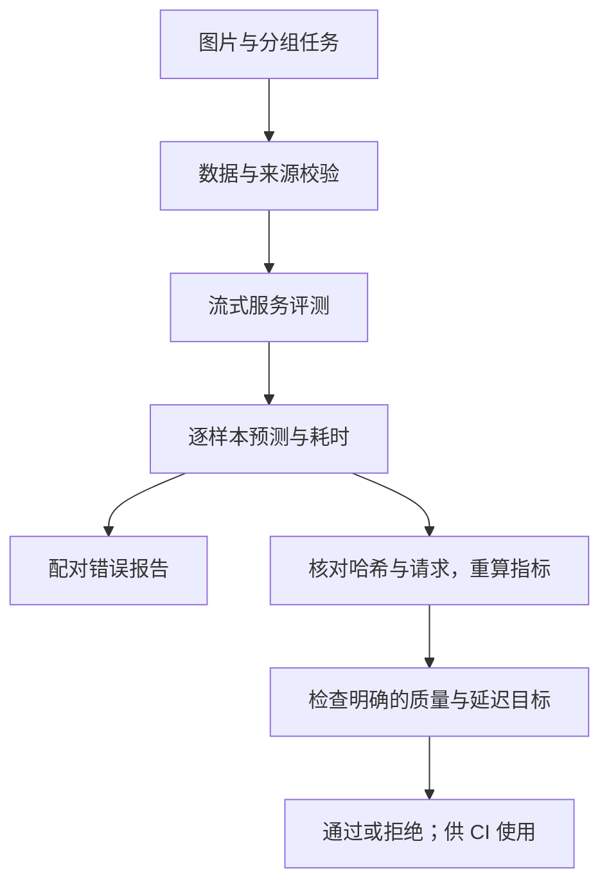

# 实现与证据边界

VLM Precision Lab 接受图片、问题、标准答案及运行目标，完成服务评测、
量化前后配对比较和预算检查。使用者拿到原始记录、错误样例和放行／拒绝结果。

## 已实现的流程

| 工作 | 实现 |
| --- | --- |
| 防止错配和来源泄漏 | `data.py`：ID、图片哈希、路径及文档分组检查 |
| 测量完整请求 | `serving.py`：SSE、并发、失败行、首段回答、延迟与吞吐 |
| 防止平均分掩盖损失 | `metrics.py`：配对得失、分任务统计、按文档 bootstrap |
| 检查测量记录与目标 | `gate.py`：重算指标、核对请求与数据，返回状态码 |
| 对照实际测完的配方 | `repair.py`：任务、文件与可选服务限制；不生成新配方 |
| 接入真实收据 | `cord.py`：固定原始文件哈希，按收据分组，跳过歧义字段 |

## 怎样避免错误归因

HF 记录核对实际输入张量指纹；服务记录核对发送的图片、问题和解码参数。
两种指纹不能混用。服务端张量和权重不可见时，报告明确保留这一限制。
模型 revision 和服务配置属于声明，API 客户端不把它们当作权重认证。

质量检查把失败请求计入分母，吞吐把失败与客户端准备计入墙钟时间。
延迟覆盖全部请求，首段回答延迟只统计成功流；token 截断单独统计。
比较部署方法时需要相同硬件和工作负载，并记录引擎与缓存设置。

## 当前证据

- CPU：20 项客户端、数据、统计、记录核验和预算检查通过。
- CORD-v2：100 张验证收据，273 个字段问题，原始文件 SHA256 已核对。
- 旧 Qwen3-VL-8B 实验：上游 AWQ 文件 17.53 → 7.22 GB；HF 检查路径峰值
  allocated 16.47 → 20.26 GiB。300 个合成开发样例没有内容退化。

真实收据预测、受控 vLLM GPU 资源与吞吐实验尚未完成。本版没有自动选层、
自定义量化算法、CUDA 算子或加速收益主张。现阶段定位为评测与部署检查组件。

[使用步骤](service-evaluation.md) · [旧实验明细](experiments.zh-CN.md) ·
[原研究设计（包含待验证假设）](https://github.com/chrischen-coder/vlm-precision-lab/blob/4ed0b85a4cffbd1aab2b6131e76dd04f1a4586e2/docs/design.zh-CN.md)

后续只有确认了实际内容损失或执行瓶颈，才开展针对性方法改进；
需要与适用的强基线比较，并计入校准、搜索和部署成本。
