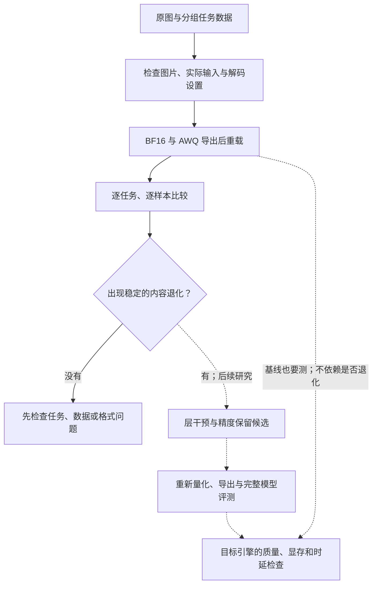

# VLM Precision Lab：为什么做、怎样做、还缺什么

## 背景

图文模型被用来读取票据金额、设备标识和图中的连接关系。这类任务要求答案准确：
少一个负号、截掉一位编号，或者找错一条线，都可能使后续操作出错。
部署团队会用量化缩小模型，但通常拿到的是一张平均分表，很难知道哪些原来正确的答案丢了。

项目从一个具体场景开始：单张 RTX 5090 上运行 Qwen3-VL-8B-Instruct，
输入一张静态图片和一个字段或连线问题，以 BF16 结果为参照检查压缩后的变化。
BF16 已经能在这张卡上运行；修正后的检查脚本峰值 Torch allocated 约 16.47 GiB。
所以理由不是“原模型跑不了”，而是压缩能否减少发布体积，并给服务留下更多资源。
并发、显存和速度收益要靠后端实测确认。

公开需求也有类似线索：[LLM Compressor #1629](https://github.com/vllm-project/llm-compressor/issues/1629)
记录了 Qwen2.5-VL 量化掉分的定位需求；[AutoRound #2071](https://github.com/intel/auto-round/issues/2071)
讨论了校准数据的覆盖。它们帮助确定问题，不代表我们复现了当前版本的缺陷，也不说明发生频率。

## 问题

给定一个开放权重模型、一组关键任务和资源预算，回答三个问题：

1. 哪些原来正确的答案在压缩后变错了？恢复了哪些答案？
2. 是内容错误、格式错误，还是输入和运行设置不同造成的变化？
3. 如果确有内容退化，能否在预算内保留少量高精度层，并通过实际导出和后端检查？

前两项已有实现，第三项仍是研究计划。目前的配方筛选器只比较已经测完的候选，
不自动生成组合，也不执行选层搜索。

首版只测数字字段、接口标识和带标签连线的端点。数字、符号、小数位必须严格一致。
图关系同时报告严格匹配和无序端点正确率：`B,D` 与 `D,B` 内容相同，但后者可能违反接口的排序要求。

## 做法

实线部分已有记录；虚线部分尚未完成。校准数据始终来自 calibration 分区，
开发数据用于诊断和方法选择，测试数据留到方案冻结之后。

### 让对照成立

模型 revision 固定为 `0c351dd01ed87e9c1b53cbc748cba10e6187ff3b`。
比较时核对原图、实际输入张量、处理器设置、greedy 解码和输出长度。
张量指纹不同，比较器默认拒绝把差异归因于量化。

AWQ 使用 LLM Compressor 的实现，只压缩 decoder 线性层，视觉模块与 `lm_head` 保持 BF16。
RTN 模拟量化用来检查流程；它仍存储和计算 BF16 稠密权重。
私有 GLM API 可以辅助开发，但无法提供这类实验需要的开放权重和层激活，也不充当字段答案的裁判。

### 按实际成本选校准数据

代码提供随机、按任务分层和特征覆盖三种选样方式。成本由固定处理器测得，包含视觉 token，
并限制同一来源的样本数。覆盖启发式按“新增特征覆盖 / 输入 token”排序：

\[
\operatorname{score}(x\mid S)=\frac{\sum_{f\in F(x)} w_f/(1+n_f(S))}{c(x)}.
\]

它是一个可检查的启发式，不保证最优。现有正式 AWQ 使用分层选出的 177 例、73,986 个 token。
三种策略的质量对照尚未完成；设置同一个预算上限，也不能替代报告实际消耗。

### 如果需要保留精度

计划先以完整 decoder 层为干预单位，比较恢复某层 BF16 后，任务答案和正确率是否改变。
概率或损失用于缩小候选范围，最终选择依据是完整模型的任务结果和实际文件成本。
单层收益不能直接相加，所以每个组合都要重新评测。

AWQ 会改变权重缩放，不能把未经对应变换的原始 BF16 权重随意塞回量化层。
正式候选应从原模型重新生成保留配置，重新校准、导出和重载。
当前筛选器已支持文件预算、任务门槛和可选 p95 门槛；显存约束和后端支持检查还没有实现。

## 现有证据改变了什么

300 个合成开发样例来自 150 个生成来源，使用同一生成器家族。
正式 AWQ 导出后，权重文件从 17.53 GB 降到 7.22 GB。
两类 OCR 均为 100%；图端点内容正确率从 50% 到 53%，严格匹配从 41% 到 33%。
11 个严格退化都是内容正确、顺序不符；内容退化为零。

这意味着当前应先处理评分和输出格式，并评测更有代表性的数据。
现在做复杂选层，缺少需要修复的内容错误，也就无法证明方法有效。
这几个恢复样例同样不足以说明量化改善了识别能力。

HF 检查路径的峰值 allocated 从约 16.47 GiB 增到 20.26 GiB，生成耗时也增加。
文件压缩已经成立，优化引擎的资源收益尚未测量。
另因缺少同一 AWQ 模型导出前的预测，目前只能检查端到端质量，不能分离打包与重载的影响。
详细数字、失败运行和源码快照见[实验记录](experiments.zh-CN.md)。

## 技术难点与可能的改进

| 难点 | 需要完成的工作 | 当前状态 |
| --- | --- | --- |
| 平均分隐藏不同样例的得失 | 配对比较、分任务统计、展示原图 | 已实现 |
| 预处理变化混入量化比较 | 检查实际张量和运行配置 | 已实现；尚缺导出前后的单独对照 |
| 校准开销不易公平比较 | 实测 token 成本与来源限制 | 选样已实现；策略质量消融未完成 |
| 层误差不等于任务错误 | 层干预，与随机保留和重建误差比较 | 未实现 |
| 搜索结果可能无法部署 | 从原模型重建候选，在目标引擎测量 | AWQ 导出与 HF 重载完成；目标引擎未测 |

已有工程工作的价值是减少错误归因，让别人能追到原图、预测和具体运行。
若要形成算法上的改进，还需证明任务错误比重建误差更适合决定哪些层保留精度。

[MBQ](https://github.com/thu-nics/MBQ)已有模态平衡量化，
[AutoRound](https://github.com/intel/auto-round)已有混合精度方案。
因此不能把“多模态量化”或“自动选层”本身当作创新。
值得检验的区别是：在相同实际文件成本和后端支持单元下，按关键任务的错误选层是否更好。
需要胜过预算匹配的随机保留、重建误差保留和一个适用的强基线，并在独立数据上重复。
如果没有优势，就采用更简单的方案。

## 接下来按什么顺序做

1. 适配 [CORD-v2](https://huggingface.co/datasets/naver-clova-ix/cord-v2) 的金额、税额和找零任务。
   元数据已固定，数据适配与推理尚未完成。训练划分做校准，验证划分做开发，测试划分冻结。
   多个字段仍按同一张收据分组；100 张测试收据只用于早期检查。
2. 在同一目标引擎、图像尺寸、序列和并发下，测 BF16 / AWQ 的显存、延迟与吞吐。
   先用 profiler 确认瓶颈，再决定是否需要算子优化。
3. 有稳定内容退化后，比较实际成本接近的校准策略，再做选层干预。
4. 候选方案冻结后，运行独立测试和第二模型。较小样本的零退化不能证明 1–2 pp 的不劣结论。

每一步留下输入、预测、配置、源码版本和失败记录。现有环境的 CPU cgroup 限额为 16 GiB；
校准使用 GPU 驻留权重和第二张卡的激活缓存，不能按宿主机总内存估计可用资源。
兼容修正来自上游 PR，出处保留在 `NOTICE` 中。

本项目目前能展示量化实验、PyTorch 多模态推理和结果核验的能力。
剪枝、蒸馏、自定义 CUDA 算子和 NPU 部署尚未开展；AWQ 与 RTN 都属于量化，不能算两种压缩技术。
