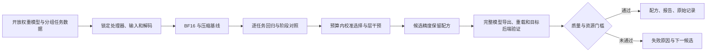

# VLM Precision Lab：关键任务约束下的多模态模型压缩

这是项目一的详细技术设计。状态：P0 原型；模型与方法的效果由原始实验记录证明。文中“目标”“假设”“候选贡献”都不表示已经取得的成绩。

## 1. 项目背景：部署团队为什么需要它

图文模型可以读取单据、表格、界面截图和拓扑图。部署时，团队会用低比特权重量化减少模型文件和权重常驻开销。但上线真正关心的是：金额是否读对、接口标识是否完整、某条连线是否连接正确的节点。这些任务要求精确回答，“语义大致相同”不能替代数值、符号和关系正确。

设想一个具体需求：把 Qwen3-VL-8B-Instruct 部署到单张 5090，服务用户上传的静态图像，读取指定字段或查询指定连线。现有 BF16 版本是质量参照；压缩后必须满足关键任务质量限额，再看体积、显存和时延。项目提供可复现的压缩回归定位与精度保留方案，不承诺模型能解决所有文档和运维问题。

修正输入生命周期后的 BF16 全开发集运行峰值约 16.47 GiB，已经能在 32GB 5090 上运行；这不是标准服务单请求峰值。因此项目不以“原模型完全跑不了”为理由。压缩的实际价值需要通过较小的发布文件、同卡更大的上下文／并发余量或更低的服务成本证明；这些收益不能从参数 bit 数直接推断。先证明关键字段质量可保留，再测同一后端的资源收益。

选择这个问题有公开线索：[LLM Compressor #1629](https://github.com/vllm-project/llm-compressor/issues/1629)记录过 Qwen2.5-VL 量化掉分与定位需求；[AutoRound #2071](https://github.com/intel/auto-round/issues/2071)讨论更丰富的校准数据与任务覆盖。这些是需求线索，不是我们已复现的当前框架缺陷，也不能从挑选的 issue 推断全社区发生频率。

## 2. 要解决的具体问题

**给定开放权重 VLM、关键任务样例和资源预算，找出压缩导致的任务回归，并选择经过完整模型验证、能够导出的精度保留配方。**

这个问题包含三个相互衔接的困难：

1. **平均分掩盖关键错误。**压缩可能同时使一组样例变好、另一组变差。只看平均分，无法看到原本正确的金额或连线变错了多少。
2. **掉分原因容易混淆。**图像缩放、处理器、tokenizer、解码设置、保存／重载或后端变化都可能改变结果。未经控制，不能把整个变化解释为量化误差。
3. **精度回退容易无效或无法部署。**权重重建误差大的层，不一定造成最多业务错误；单层敏感度的收益也不能直接相加。随意混合位宽可能违反后端融合与格式限制。保留太多 BF16 层，则失去压缩收益。

第一版的输入只包含静态单张图片与一个问题。任务限制为数字字段、接口标识与带标签连线的端点查询。分别做严格 exact match、无序端点集合正确率与输出格式检查；端点顺序错误不能冒充关系识别错误。中文、真实复杂文档、多图、长视频和通用聊天是后续单独验证的扩展。

## 3. 项目最终给使用者什么

输入：开放模型目录、带来源分组的任务 JSONL、任务质量限额、文件／显存／时延预算、指定运行后端。

输出：

- 逐任务对照报告：原模型和压缩模型的绝对分数、退化与恢复数量、独立来源数、配对区间、具体失败样例。
- 分阶段证据：原始推理、模拟量化、压缩导出／重载、同一目标后端的 BF16／压缩对照。
- 校准样本清单与成本：为什么选这些样例，实际输入 token 消耗多少，覆盖了哪些任务和困难特征。
- 候选配方：哪些完整 decoder 层保留高精度，以及它是否通过导出、重载和任务门槛。没有可行配方时明确返回失败。
- 复现记录：固定模型 revision、图片与输入张量哈希、处理器与解码配置、版本、源码、原始预测和资源测量口径。

## 4. 怎样解决：从可控回归到实际配方

### 4.1 先锁定一个有效的对照

主模型采用 [Qwen3-VL-8B-Instruct](https://huggingface.co/Qwen/Qwen3-VL-8B-Instruct)，权重 revision 固定为 `0c351dd01ed87e9c1b53cbc748cba10e6187ff3b`。它提供开放权重；私有 GLM API 不能替代获取权重、激活和模块进行量化实验。5090 承担本项目的本地推理、校准与干预；GLM 后续可以帮助整理候选失败解释，但不作精确字段的真值裁判。

保留一份未改动的 BF16 结果。对所有方案使用相同图片、prompt、像素上限、实际输入张量、greedy 解码和输出长度限制。输入指纹不一致时，比较器默认拒绝量化归因；额外的处理器实验必须单独标明。

第一条正式压缩路径复用 [LLM Compressor 官方 Qwen3-VL AWQ 示例](https://github.com/vllm-project/llm-compressor/blob/main/examples/multimodal_vision/qwen3_vl_example.py)的 W4A16 量化与压缩导出。视觉模块、`lm_head` 的处理方式在各方案间一致。RTN 模拟量化只用于低成本探查，不能代表 AWQ，更不能代表 INT4 推理内核。

第一阶段保持视觉编码器和 `lm_head` 为 BF16，只量化语言 decoder 的线性层。这是对多模态模型的局部压缩，不是对所有模态模块的全量低比特化；图文任务变化只能用于研究 decoder 压缩后的行为，不能据此宣称视觉编码器本身被量化损坏。

### 4.2 在同等成本下选择校准数据

默认文本校准与特定图文任务的分布可能不同。我们先比较随机、按任务分层与困难特征覆盖三种选样方法；所有样本只能来自 calibration 分区。

首版覆盖选择器采用具有递减收益的透明启发式：

\[
\operatorname{score}(x\mid S)=\frac{\sum_{f\in F(x)} w_f/(1+n_f(S))}{c(x)}.
\]

`F(x)` 是任务、数字／符号、字号与连线特征；`n_f(S)` 是已选样本对该特征的覆盖数；`c(x)` 由固定处理器实际测得，是输入 token 数，不是字符串长度。对同来源样例设上限，防止同一个简单模板占满校准预算。选择器不读取开发／测试答案，也不将罕见特征直接等同于量化风险。

该启发式本身不声称原创最优算法。研究问题是：在相同 token 上限、像素上限和来源约束下，它是否比强随机／分层校准更能保住关键任务。上限相同不代表实际开销完全相同，所以另报实际消耗、样本数与量化耗时，并设置相近实际成本的对照。

### 4.3 用任务干预寻找需要保留精度的层

对模拟量化模型，逐次将一个完整 decoder 层的量化线性权重恢复为原有 BF16，观察关键任务答案概率与最终正确率变化。整层为初期搜索单位，保持 Q/K/V 精度一致；之后再验证更细粒度的后端可支持单元。

排序依据采用“最差任务组的质量缺口改善／新增权重成本”，和按权重重建误差、预算匹配随机保留比较。概率／损失信号用来降低搜索成本；最终任务 EM 才决定候选是否值得导出。单层结果只能提名候选，每次组合都重新测完整模型，不以分数相加证明组合最优。

RTN 和 AWQ 的权重变换不同。不能把原始 BF16 权重直接塞回已经做了 AWQ 缩放的层并宣称完成修复。正式 AWQ 精度保留必须在原 BF16 模型上重新生成 ignore 配方，重新校准、导出、重载，再评价组合。该机制避免模拟方案与实际导出方案脱节。

### 4.4 把搜索写成有失败出口的约束问题

令 `R` 表示保留高精度的层集合。候选选择目标是：

\[
\min_R C_\text{measured}(R),\quad
\text{s.t. } Q_g(R)\ge Q_g(\text{BF16})-\delta_g,\ \forall g,
\]

并满足实际文件预算、指定后端可加载、需要时的显存与 p95 门槛。`Q_g` 为第 `g` 类关键任务质量；`C_measured` 使用真实测量，不用理论平均 bit 数替代。正式“质量不劣”主张还需要预先定义统计检验及足够独立来源；300 个开发样例只用于发现问题和选择方法。

首版采用有限候选的贪心搜索与核验，明确不保证全局最优。配方筛选器只接受已测完整候选；没有合格方案就返回“不可行”，不通过调整测试集、降低标准或重复挑选最好种子绕过门槛。

### 首轮实测对选题的约束

2026-10-03 的 300 例合成开发集已经跑过 BF16 与对称 group-128 W4 RTN 模拟量化。数字与接口标识在两种方案下均为 100%；图关系严格 EM 为 41% → 32%，但无序端点正确率为 50% → 52%，没有出现原本关系正确变为关系错误的样例。严格分数下降主要体现端点输出顺序；确定性的排序是必要的强对照，不值得用复杂精度搜索替代。

因此，该数据集目前**不支持“关键感知能力被量化损坏、需要算法修复”的主张**，也未支持任务驱动选层优于现有方法。它验证了管线，并暴露了原模型在交叉连线上的不足和评分口径混淆。接下来应在合法真实文档／更有代表性的独立来源上验证正式 AWQ 的内容回归，再进入修复实验。若仍无回归，则调整研究问题或停止该算法方向。项目不能靠漂亮的严格 EM 掉分曲线掩盖这个结论。

正式 AWQ 导出与独立 HF 重载也已完成：权重文件减少 58.8%，两类 OCR 均为 100%，图端点内容正确率为 50% → 53%，仍无内容退化样例。HF 路径峰值 allocated 从约 16.47 GiB 增至 20.26 GiB，生成累计时间也更长。因此，目前能够主张的是**文件压缩与这批诊断样本上的质量核验**；目标引擎收益和真实内容回归均待验证。任务驱动精度保留继续作为研究假设，不把复用 AWQ 的成功当作自己的量化算法创新。数据、脚本哈希、原始预测和失败记录见[实验报告](experiments.zh-CN.md)。

### 4.5 区分保存正确与部署有效

压缩文件保存成功不等于真实部署成功。需要分开核验：

| 比较 | 可以支持的结论 |
| --- | --- |
| BF16 vs 同输入模拟量化 | 本实现的权重扰动与任务变化关联；不代表压缩内核收益 |
| 量化前保存 vs 导出／HF 重载 | 在受控输入与解码下检查格式、重载和数值行为 |
| 目标后端 BF16 vs 同后端压缩模型 | 检查该后端内的量化质量与资源取舍 |
| HF BF16 vs 后端 BF16 | 单独检查后端本身的差异 |

[compressed-tensors 文档](https://huggingface.co/docs/transformers/quantization/compressed_tensors)说明压缩存储与执行方式可以不同。HF 重载若解压为稠密权重，就只能证明文件压缩与重载质量，不能宣称显存下降或 INT4 内核加速。推理性能另在支持该格式和 SM120 的后端实测。

目标服务后端暂定 vLLM 的 compressed-tensors W4A16 路径，单卡先测 batch 1，再测固定并发与输出长度。先通过“本模型＋本量化格式＋5090 SM120”烟测，再固定可运行版本、实际选中的 kernel 和环境；[官方量化文档](https://docs.vllm.ai/en/latest/features/quantization/)列出通用格式支持，并不替代这个具体组合的验证。未通过烟测时就记录“不支持”，不能通过 HF 稠密执行冒充引擎部署。

## 5. 技术壁垒具体在哪里

| 难点 | 需要自己完成的工作 | 可以交给面试官核对的证据 |
| --- | --- | --- |
| 多模态误差不能用文本平均分代替 | 构造关键字段／关系任务、反事实样例、逐组配对指标 | 数据卡、原始预测、关键组回归与失败案例 |
| 敏感度指标与业务错误可能错位 | 实现层级干预、损失筛选、实际错误验证 | 任务 × 层矩阵；重建误差／随机保留消融 |
| 混合精度配方受真实后端限制 | 保持融合单元一致；AWQ 重新校准而非错误塞回权重 | 可导出配置、完整候选测量、重载一致性 |
| 各阶段变化混杂 | 对输入、处理器、解码、权重格式与来源建立可比记录 | 不可比实验被拒绝的测试；分阶段对照 |
| 压缩与速度不一致 | 区分文件、参数常驻、负载峰值、预处理、prefill 和 decode | 锁定负载的 Profiler 与延迟／显存曲线 |

壁垒来自理解误差机制并把它落实为可复现实验和可部署决策。安装量化库、生成一张图表、接上 API 本身都不是这个项目的技术壁垒。

## 6. 创新边界与必须证明的增量

[MBQ](https://github.com/thu-nics/MBQ)已经研究模态平衡量化；[AutoRound AutoScheme](https://github.com/intel/auto-round/blob/main/docs/step_by_step.md)已有自动混合精度方案。因此不以“首次多模态量化”“首次自动选层”作为主张。

本项目提出两个可证伪的候选贡献：

**候选贡献 A：关键任务约束的精度分配。**在固定实际资源预算与可部署单元限制下，反事实任务与实际回归信号比重建误差更能识别值得保留精度的层。必须在相同大小的配方中胜过随机保留和至少一个强混合精度基线；无增益就撤回算法创新主张。

**候选贡献 B：从模拟干预到实际导出的闭环。**把任务回归、来源分组、实际校准成本、后端限制和分阶段验证组合成可复用流程，并证明该流程能发现／避免具有真实失败样例的部署回归。它首先是工程贡献；是否达到研究创新强度，取决于案例、对照和外部复现。

困难特征覆盖选样是辅助研究变量。它不能单独证明新量化算法，也不能把多用图像 token 带来的提升说成方法提升。CUDA／Triton 优化仅在找到明确瓶颈后实施；尚无自定义算子成果。

## 7. 用什么实验让整条逻辑成立

| 要验证的假设 | 实验与对照 | 否定该假设的结果 |
| --- | --- | --- |
| 平均分会隐藏关键组回归 | BF16／统一量化，分别报 EM、退化、恢复 | 没有稳定关键组回归；调整场景，不制造损坏案例 |
| 校准分布影响关键任务 | 随机／分层／覆盖，同 token 与像素约束 | 强分层基线等好或更好；保留简单方案 |
| 任务干预比重建误差有效 | 同实际配方体积的随机／重建误差／任务选层 | 改进在第二种子／独立数据消失 |
| 模拟方案可用于实际部署 | 候选重新 AWQ、导出／重载、目标引擎 | 导出后质量收益消失或后端不支持 |
| 压缩带来实用资源收益 | 固定图像尺寸、序列、并发与成功率的后端对照 | 仅文件变小，延迟不改善；准确报告范围 |

P0 使用 192 个校准与 300 个开发样例，来源之间分开；同一记录的两个答案改变样例保留在同一分区。首批合成图像共享生成器家族，不能叫跨模板泛化。正式结果加入合法公开文档来源、独立模板／拓扑族和至少 2,000 个冻结测试样例，来源分组计算配对区间。测试答案不能进入选样、选层、阈值调整或 GLM 失败解释提示。

下一阶段已选定真实数据入口：[CORD-v2](https://huggingface.co/datasets/naver-clova-ix/cord-v2)，其公开元数据标注 CC BY 4.0，官方划分为 800 张训练、100 张验证和 100 张测试收据。元数据 revision 已保存，但尚未完成数据适配或评测。只从训练划分选校准样本，验证划分用于方法开发，测试划分冻结；金额、税额与找零分别计分，缺失／歧义字段采用预先定义的排除规则并统计排除量。一张收据上的多个问题不能冒充多个独立来源；100 张测试收据只够早期真实场景核验，不能替代计划中的更大独立来源研究。发布时保留数据引用与许可，记录原图和标注转换，避免金额归一化把真正的数字错误隐藏掉。

至少完成 BF16、统一 AWQ、强分层 AWQ、重建误差保留、预算匹配随机保留、任务保留的消融。论文基线 MBQ 在其原生支持的第二模型上复现；未经核对的迁移实现不冒充官方基线。一个模型、几个合成样例足以检查管线，不足以证明普适创新。

## 8. 完成标准与停止条件

按证据门槛推进第一项目，第二项目暂不占用主线时间：

| 阶段 | 必须交付 | 未通过时的处理 |
| --- | --- | --- |
| P0：可核验原型 | 固定模型与输入；CPU 检查；BF16／扰动预测；诚实的负结果 | 修正数据／评分与可比性，不能先宣传收益 |
| P1：真实问题成立 | 正式压缩导出／重载；CORD 开发场景中的内容回归与失败图 | 若只是输出顺序问题，用简单格式修正；若无稳定回归，不进入昂贵选层 |
| P2：方法增量成立 | 任务层干预；实际成本匹配的强分层、随机、重建误差配方消融 | 强基线等好则撤回创新主张，保留更简单实现 |
| P3：部署与外部有效性 | 冻结真实测试、第二模型、同后端显存与延迟、复现包 | 明确只发布已通过部分，不把模拟收益写成部署收益 |

单张 5090 用于服务推理，校准／干预可以使用第二张 GPU 放缓存或参照权重。容器 CPU 内存限额已实测为 16 GiB，不应按宿主机显示的总内存安排并发；先串行加载模型，再在互不竞争的卡上安排受控实验。GLM API 用于辅助开发，不绕过冻结真值或替代开放权重实验。

首个可用版本应做到：用户提供模型与数据，能运行基线、看到任务回归、得到一份通过导出／重载的配方及其测量结果。首个有说服力的求职版本还需要：

- 两个开放模型、至少一个合法真实来源评测、冻结测试与预算匹配对照。
- 争取整体权重文件减少至少 50%；关键任务下降目标 1–2 pp，按实际区间判断能否成立。
- 至少一个强基线之上的可靠收益；没有收益时清楚报告负结果，不换口径隐藏失败。
- 真实后端的显存与 p95／吞吐结果；若没有加速，就只写已验证的压缩收益。
- 至少 10 个可解释失败案例、锁定环境、一条复现命令、中英文 README、可使用的组件接口。
- 从实际问题中提出具体上游补丁，合并情况如实记录；Star／Fork 与招聘结果不作承诺。

## 9. 如何在求职材料里表达

完成实验后才填入真实数字。项目介绍模板为：

> 面向图文模型读取关键字段与图关系时的量化回归，构建 VLM Precision Lab。实现预算受控校准选择、任务驱动层干预和后端可部署的精度保留，并建立输入指纹与分阶段回归检查。在［模型／数据／硬件］上，以［真实文件／显存预算］将［关键任务退化］从［基线］改善至［实测］；代码、配方与原始结果公开可复现。

可以证明量化、PyTorch、多模态、约束优化与部署实验能力。只有正式完成训练、第二类压缩或 CUDA 算子后，才增加相应技能主张。AWQ 与 GPTQ 都是量化，不能凑成招聘要求中的两种压缩技术；后续蒸馏在项目二开展。
