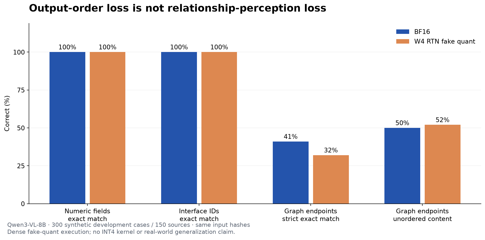
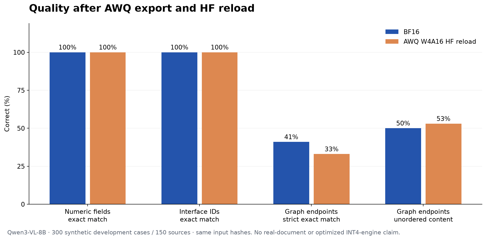

# 2026-10-03：首轮基线与研究决策

使用固定 revision 的 Qwen3-VL-8B-Instruct，在同型号 RTX 5090 上分别运行 BF16 和对称 group-128 W4 RTN 模拟量化。数字／接口／图关系各 100 例，总计 300 个开发样例、150 个生成来源。每个来源两个答案改变样例；没有运行测试集。

| 任务与指标 | BF16 | RTN 模拟量化 | 净变化 |
| --- | --- | --- | --- |
| 数字字段严格 EM | 100% | 100% | 0 pp |
| 接口标识严格 EM | 100% | 100% | 0 pp |
| 图关系严格 EM（含字母顺序） | 41% | 32% | −9 pp |
| 图关系无序端点正确率 | 50% | 52% | +2 pp |
| 图关系输出符合字母排序格式 | 78% | 62% | −16 pp |



严格图关系 EM 有 11 个退化与 2 个恢复样例，按来源配对 bootstrap 的净变化区间为 −16 到 −2 pp。但无序端点正确率没有退化样例，有 2 个恢复样例。因此，不把严格 EM 的下降解释成连线感知能力下降。排序两个已知端点是必要的简单修正，应作为强对照，而不是使用昂贵的精度搜索修复格式。

数字和接口指标的零变化区间来自这份有限样本的描述性 bootstrap，不能证明未来真实来源上的等价。原模型图关系正确率仅 50%，提示首先需要检查其绝对能力。合成数据共享生成器家族，不支持真实文档或跨模板泛化主张。

BF16 与 RTN 均保存 300 条完整输出和输入张量 SHA256；输入、模型来源、解码参数经过比较器核验。两者峰值 PyTorch allocated 均为 20,509,668,864 字节（约 19.10 GiB）。RTN 模拟量化仍以 BF16 存储并执行稠密计算，所以这个实验**没有降低文件体积或显存，也没有证明 INT4 加速**。

这两个 P0 运行使用的脚本会因 `BatchFeature.to()` 原地修改而逐渐保留整个开发集的 GPU 输入；因此上述峰值包含输入驻留，不是标准服务请求峰值。原脚本快照已保留在结果目录，后续脚本改为临时设备映射并逐批释放输入。新旧脚本的峰值不直接用来计算量化显存收益；性能结果仍须在统一后端、统一脚本下另外测量。原始质量预测与输入指纹不受这项计量限制影响。

强分层校准从 192 个候选中选出 177 例，使用 73,986 / 74,000 个输入 token，三种任务各 59 例。token 数由固定图像处理器实测，包含视觉 token；没有用字符数或估算样本数替代实际成本。

## 正式导出的兼容与资源记录

固定栈是 PyTorch 2.8.0 / CUDA 12.8、Transformers 4.57.3、LLM Compressor 0.9.0、compressed-tensors 0.13.0。这是本次受控环境，不是最新版支持情况的断言。

- 第 3 次校准因 Qwen3-VL 位置插值读取 meta 设备而失败，退出码 1。复用 [上游 PR #1958](https://github.com/vllm-project/llm-compressor/pull/1958) 的位置设备修正；在两个 dtype、两种 grid 组合的小模型对照中与原算法输出逐元素相同，最大误差为 0。这是已知兼容适配，不计原创算法贡献。
- 第 4 次校准已进入 decoder，但被 SIGKILL 终止，退出码 −9。运行前后容器 `oom_kill` 计数增加 1；CPU cgroup 限额为 17,179,869,184 字节。大量 CPU 权重与缓存造成的压力，是支持该资源诊断的证据，而不是“GPU 卡不够”的证据。
- 第 5 次改为 GPU 驻留权重、第二张 GPU 放中间激活，使用相同 177 个校准样本。37 个校准子图均跑完，但随后 data-free dispatcher 仍调用 `remove_dispatch()`，其实现会把整模型移至 CPU；该次仍被 SIGKILL 终止，没有压缩模型。
- 第 6 次在专用进程中显式绕过 sequential、data-free 与 postprocessing 三处 CPU 迁移，退出时恢复原函数；量化、缩放与压缩打包运算仍调用上游实现。完整结果以退出记录和导出／重载 manifest 为准。

失败退出记录、压缩日志与第 4 次源码快照在原始结果目录中保留；不是只保留成功运行。

## 正式 AWQ 导出／HF 重载结果

第 6 次导出及独立 HF 重载均以退出码 0 完成。BF16 同时用修正后的输入生命周期脚本复跑，300 个答案与输入指纹全部与 P0 一致。BF16／AWQ 这对结果使用同一脚本 SHA256、相同实际输入张量和解码设置。

| 指标 | BF16 复跑 | AWQ W4A16 导出／HF 重载 |
| --- | --- | --- |
| 权重文件字节数 | 17,534,339,512 | 7,224,284,152（减少 58.8%） |
| 数字字段严格 EM | 100% | 100% |
| 接口标识严格 EM | 100% | 100% |
| 图关系严格 EM | 41% | 33% |
| 图关系无序端点正确率 | 50% | 53% |
| 字母排序格式符合率 | 78% | 63% |
| 全运行峰值 Torch allocated | 17,686,825,984 字节 | 21,757,139,456 字节 |
| 300 例生成阶段累计时间 | 51.14 s | 255.11 s |
| 单例生成 p95 | 255.06 ms | 1,169.49 ms |



图关系严格指标有 11 例退化、3 例恢复，净变化区间 −15 到 −1 pp；内容指标有 0 例退化、3 例恢复，净变化区间 0 到 +6 pp。仍然没有支持内容修复算法的需求；同样不能把这几个恢复当作新算法的效果。保存处理器后部分文件哈希不同，但设置和全部实际输入张量一致；这支持本批固定输入对照，不证明两个处理器在任意新输入上等价。

**本次得到文件压缩收益，没有得到 HF 路径的显存／速度收益。**标准 `CompressedLinear` 在首次前向解包权重后调用普通线性计算；保存文件更小不表示使用了优化 INT4 内核。上述时间来自质量检查脚本，排除图像处理、指纹计算和服务排队，运行在两张同型号卡上；BF16 运行期间另卡还在校准，不把这组数据宣传为受控服务 benchmark。实际内存与性能问题需在固定目标引擎、负载和 profiler 下验证。原始文件与环境已保留，后续不能用只报文件体积的方式隐藏这一限制。

另一个阶段边界是：没有保存同一 AWQ 模型导出前的开发集预测，因此此处验证的是压缩管线端到端质量，没有单独证明打包／重载与导出前数值完全一致。后续的分阶段验证需补齐这个对照。

## 决策

RTN 与正式 AWQ 都没有在这批数据上支持“关键内容能力被量化破坏”的假设，也没有支持新算法优于已有方法。导出／HF 重载闭环已完成；下一道门槛是在合法真实文档及具有独立来源的更代表性数据上确认问题，同时验证目标引擎资源收益。没有明确内容回归前，不扩张精度搜索或宣称算法创新。

## 复现与原始记录

- [固定输入与数据卡](../examples/diagnostic-v2/)
- [BF16 原始预测与 manifest](../experiments/results/2026-10-03/p0-bf16/)
- [RTN 原始预测与 manifest](../experiments/results/2026-10-03/p0-fake-rtn/)
- [比较报告 JSON](../experiments/results/2026-10-03/p0-rtn-report.json)／[离线 HTML](../experiments/results/2026-10-03/p0-rtn-report.html)
- [实际校准选样与成本](../experiments/results/2026-10-03/calibration-stratified.selection.json)
- [明确的研究决策](../experiments/results/2026-10-03/decision.json)
- [BF16 复跑](../experiments/results/2026-10-03/p1-bf16/)／[AWQ HF 重载](../experiments/results/2026-10-03/p1-awq-reload/)
- [正式比较报告](../experiments/results/2026-10-03/p1-awq-report.json)／[离线 HTML](../experiments/results/2026-10-03/p1-awq-report.html)
- [压缩 manifest](../experiments/results/2026-10-03/compression-manifest.json)／[导出文件 SHA256](../experiments/results/2026-10-03/awq-export-file-hashes.json)
- [兼容修复的算术对照](../experiments/results/2026-10-03/offload-compat-parity.json)

只复现报告无需 GPU：

```bash
precisionlab compare --dataset examples/diagnostic-v2/samples.jsonl \
  --reference experiments/results/2026-10-03/p0-bf16/predictions.jsonl \
  --candidate experiments/results/2026-10-03/p0-fake-rtn/predictions.jsonl \
  --output runs/reproduced-report.html
```

GPU 运行步骤见 README，固定输入使用 `examples/diagnostic-v2/samples.jsonl`。模型权重、字体与私有 API 凭据均不包含在仓库内。
